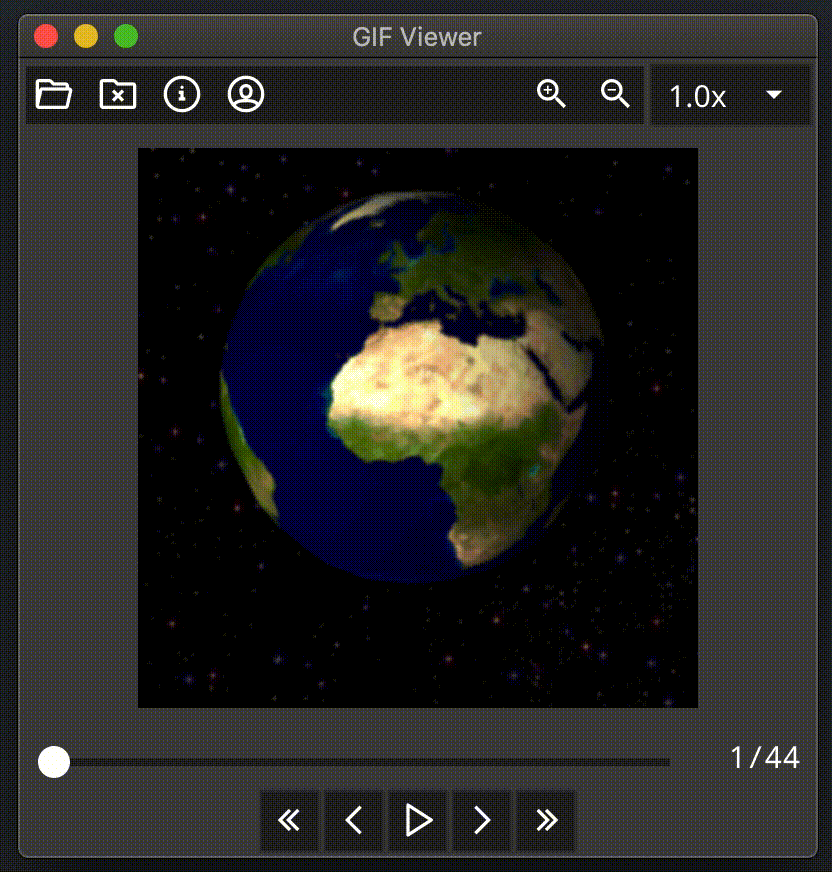

go-gif-viewer
====

Simple animated GIF viewer with Go and [Fyne](https://fyne.io/)

## Installation

`$ go get github.com/lusingander/go-gif-viewer`

## Usage

`$ go-gif-viewer sample.gif`

or

`$ go-gif-viewer` and select open file icon ().

### Keybindings

|Key|Description|Icon|
|-|-|-|
|←|Go to previous frame||
|→|Go to next frame||
|↑|Go to first frame||
|↓|Go to last frame||
|Space|Play / Pause| / |
||||
|+|Zoom in||
|-|Zoom out||
|[|Decrease playback speed|-|
|]|Increase playback speed|-|
||||
|⌘O|Open image file||
|⌘W|Close image file||

----

Sample image: By <a href="//commons.wikimedia.org/wiki/User:Marvel" title="User:Marvel">Marvel</a> - Based upon a NASA image, see <a rel="nofollow" class="external autonumber" href="http://visibleearth.nasa.gov/view_rec.php?id=2433">[1]</a>., <a href="http://creativecommons.org/licenses/by-sa/3.0/" title="Creative Commons Attribution-Share Alike 3.0">CC BY-SA 3.0</a>, <a href="https://commons.wikimedia.org/w/index.php?curid=20654992">Link</a>
